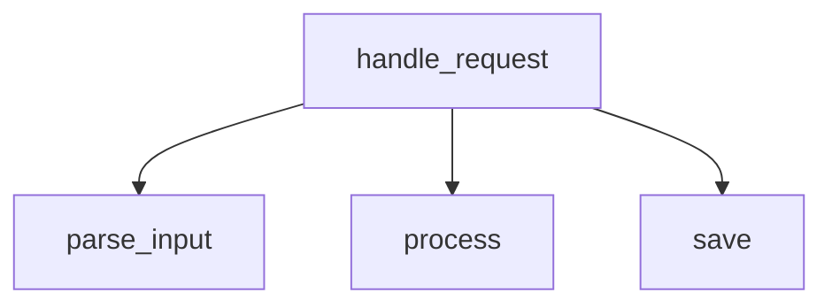

# Concept Paper: A Local, Low-Overhead, Multi-Model AI Agent Architecture for Reliable Tool Use and Code Visualization

## Abstract

This paper proposes a local AI agent architecture designed for constrained hardware, especially systems with approximately 6 GB VRAM and a consumer-grade CPU. The core idea is to avoid using a single large model for every task. Instead, the system is decomposed into small, specialized components: intent classification, planning, structured argument generation, validation, execution, and optional post-processing. For code understanding and diagram generation, the system relies first on deterministic parsing and static analysis, and only then uses an LLM for annotation or summarization. This makes tool use more reliable, reduces compute cost, and improves debuggability.

---

## 1. Problem Statement

A local AI system often fails for one of two reasons:

1. It tries to do everything with one model.
2. It lets the model produce free-form output where strict structure is required.

This causes unreliable tool calling, weak parsing of tasks, and incorrect code or workflow diagrams. On limited hardware, the problem is amplified because larger models are expensive to run and smaller models are less forgiving of ambiguity.

The objective is to build a local agent that:

* runs efficiently on modest hardware,
* uses tools reliably,
* supports modular sub-tasks,
* can inspect code and produce accurate relationship diagrams,
* and avoids using the LLM as a substitute for deterministic software.

---

## 2. Core Thesis

The best-performing local AI setup is not “one smart model,” but a pipeline of specialized components with strict contracts.

The system should follow this principle:

> **Deterministic parsing first, model reasoning second, structured validation always.**

This applies equally to tool use and to code visualization.

---

## 3. Design Goals

### 3.1 Reliability

The system should prefer predictable outputs over clever ones. A tool call that is 99% correct in format but 60% correct in content is not acceptable.

### 3.2 Low Resource Usage

Models should be selected so that the main reasoning model can fit on limited VRAM, while auxiliary tasks run on CPU or very small models.

### 3.3 Modularity

Each function of the system should be replaceable without changing the rest of the pipeline.

### 3.4 Strong Output Contracts

Every model output should be validated against a schema or rule set before it reaches execution.

### 3.5 Deterministic Structure Extraction

For code, the system should extract structure from source text using parsers and static analysis rather than asking the LLM to guess the structure.

---

## 4. System Overview

The proposed system is a pipeline of distinct stages:

```text
User Input
   ↓
Intent Classifier
   ↓
Planner
   ↓
Structured Argument Generator
   ↓
Validator
   ↓
Tool Executor
   ↓
Optional Response Rewriter
```

For code analysis and diagram generation, the flow becomes:

```text
Code
   ↓
AST / Static Analysis
   ↓
Structured Graph Representation
   ↓
Optional LLM Annotation
   ↓
Deterministic Mermaid Rendering
```

The most important rule is that the LLM never directly becomes the source of truth for structure.

---

## 5. Component Roles

### 5.1 Intent Classifier

This component determines what kind of input has been received.

Typical labels:

* command
* question
* follow-up
* clarification request
* tool trigger
* code analysis request

This component should be cheap, fast, and ideally CPU-only. It does not need deep reasoning.

---

### 5.2 Planner

The planner decides what action should happen next.

Possible planner outputs:

* answer directly,
* call a tool,
* ask for clarification,
* delegate to a sub-agent,
* analyze code,
* generate a diagram.

The planner should not execute tools. It should only produce a structured plan.

---

### 5.3 Structured Argument Generator

This component turns a plan into precise arguments for a tool or downstream function.

Example output:

```json
{
  "action": "call_tool",
  "tool": "calendar.update",
  "arguments": {
    "event_id": "12345",
    "new_time": "2026-05-10T15:00:00"
  }
}
```

This stage is where strict schema compliance matters most.

---

### 5.4 Validator

The validator checks whether the model output is usable.

It should reject:

* invalid JSON,
* missing required fields,
* unknown tool names,
* type mismatches,
* unexpected extra structure when strict mode is enabled.

This stage protects the executor from model errors.

---

### 5.5 Tool Executor

This is the zero-intelligence layer.

It receives a valid tool request and runs the actual function, script, or API call.

It should not interpret natural language. It should only accept validated structured input.

---

### 5.6 Optional Response Rewriter

After a tool has produced output, a small model can rewrite the result into a better user-facing message.

This is optional. In many cases, the raw tool output plus a short templated response is enough.

---

## 6. Model Strategy

The architecture works best when different jobs are handled by different classes of models.

### 6.1 Main Reasoning Model

Use a quantized 7B-class instruct model for planning and non-trivial reasoning.

This model should handle:

* ambiguous requests,
* multi-step decisions,
* tool selection,
* synthesis of several inputs.

It should not be used for everything.

### 6.2 Small Classification Models

Very small models or even classical ML can handle:

* yes/no classification,
* intent detection,
* task routing,
* prompt type identification.

These tasks are better solved cheaply and consistently.

### 6.3 Embedding Models

Embedding models can support:

* semantic routing,
* similarity-based retrieval,
* task clustering,
* document search,
* codebase lookup.

These belong on CPU unless latency is critical.

### 6.4 Speech Models

Speech-to-text can be handled by lightweight Whisper variants or other compact transcription systems.

### 6.5 Formatter Models

A small model can be used for:

* Markdown conversion,
* LaTeX conversion,
* text normalization,
* short rewriting tasks.

These tasks should not consume the main model unless necessary.

---

## 7. Why JSON Beats Free-Form Text for Tool Calling

Tool use becomes unreliable when the model can improvise the structure.

JSON provides:

* explicit keys,
* predictable types,
* validation,
* machine readability,
* easy recovery from errors.

A tool interface should require strict JSON, not prose.

Example:

```json
{
  "action": "call_tool",
  "tool": "notes.create",
  "arguments": {
    "title": "Meeting Summary",
    "content": "..."
  }
}
```

This makes the workflow auditable and testable.

---

## 8. Why Mermaid Is Better as a Rendering Target Than as a Source of Truth

Mermaid is useful because it is compact and readable. However, it should not be treated as the primary representation of structure.

The better approach is:

1. extract structure into a graph object,
2. validate that graph,
3. render Mermaid from that graph.

This avoids relying on the model to generate correct diagram syntax and correct relationships at the same time.

---

## 9. Code Understanding Pipeline

For code, the recommended pipeline is:

```text
Source Code
   ↓
AST Parser / Static Analysis
   ↓
Graph / Structure Extraction
   ↓
Optional LLM Annotation
   ↓
Mermaid Rendering
```

This pipeline is more reliable than asking an LLM to read code and produce a diagram directly.

### 9.1 What AST Extraction Can Capture

* function definitions
* function calls
* class and method structure
* imports
* some local control flow patterns

### 9.2 What AST Extraction Does Not Fully Capture

* dynamic dispatch
* runtime polymorphism
* hidden side effects
* event-driven runtime flows
* indirect calls resolved only at execution time

Because of these limitations, static analysis should be treated as a strong approximation of structure, not perfect runtime truth.

---

## 10. Recommended Representation for Internal Graphs

A graph should be represented internally as structured data, not as a diagram.

Example:

```json
{
  "nodes": [
    "handle_request",
    "parse_input",
    "process",
    "save"
  ],
  "edges": [
    ["handle_request", "parse_input"],
    ["handle_request", "process"],
    ["handle_request", "save"]
  ]
}
```

This structure is:

* easy to validate,
* easy to transform,
* easy to annotate,
* easy to render to Mermaid,
* easy to compare in tests.

---

## 11. Mermaid Rendering as a Final Step

Once the graph is validated, Mermaid can be produced deterministically.

Example:



If labels are needed, those should come from validated metadata, not guessed text.

---

## 12. Flowchart Generation from Prompts

Flowcharts generated from prompts can be useful, but only if the prompt is converted into an explicit intermediate representation first.

A safe workflow is:

```text
Prompt
   ↓
Structured Step Extraction
   ↓
Validated Flow Object
   ↓
Mermaid Rendering
```

This is more reliable than directly asking a model to “draw a flowchart.”

---

## 13. Reliability Principles

### 13.1 Never let a model be both parser and executor

The model can suggest structure, but execution must be handled by software.

### 13.2 Never trust unvalidated output

Any model output used for tools, graphs, or code generation should be checked.

### 13.3 Prefer narrow tasks

A tiny model with a narrow task and a strict schema often outperforms a larger model asked to do everything informally.

### 13.4 Keep the model out of ground truth generation

Ground truth should come from parsers, validators, and deterministic functions.

---

## 14. Performance Principles for Low-VRAM Hardware

On a machine with limited VRAM, the best use of resources is:

* one main quantized reasoning model,
* CPU-based classifiers and embeddings,
* deterministic utilities for parsing and validation,
* specialized smaller models only when they are clearly cheaper than using the main model.

This prevents GPU exhaustion and reduces context-switch overhead between large models.

---

## 15. Practical Sub-Agent Strategy

A “sub-agent” should not necessarily mean another full LLM-driven agent.

It can simply be:

* a classifier,
* a parser,
* a formatter,
* a retrieval step,
* a code analyzer,
* a specialized tool wrapper.

This reduces complexity and improves predictability.

---

## 16. Failure Modes

### 16.1 Hallucinated Relationships

A model may invent connections that are not present in the source code or prompt.

### 16.2 Missing Edges

A model may omit important steps or calls when the input is incomplete.

### 16.3 Overgeneralization

The model may collapse distinct functions or steps into one because the prompt is ambiguous.

### 16.4 Invalid Structured Output

The model may emit JSON-like text that fails schema validation.

### 16.5 Tool Misrouting

A planner may choose the wrong tool when the task boundaries are vague.

The architecture should treat these as normal failure modes and defend against them systematically.

---

## 17. Recommended Implementation Pattern

The most robust pattern is:

```text
Input → Classifier → Planner → JSON Validator → Tool Executor → Optional Rewriter
```

For code analysis:

```text
Code → AST Parser → Graph Builder → Validator → Mermaid Renderer → Optional LLM Labeling
```

These are not the same pipeline, but they share the same design philosophy: structure first, model second.

---

## 18. Conclusion

For a local AI system with limited hardware, the most effective architecture is not a single all-purpose model. It is a layered system where:

* classification is cheap,
* planning is bounded,
* tool calls are structured,
* code understanding begins with deterministic analysis,
* and diagrams are rendered from validated intermediate representations.

This design gives better reliability, better performance, and better maintainability than relying on a single larger model to interpret, reason, execute, and visualize everything at once.

---

## 19. Summary of the Main Recommendation

The highest-value change is this:

> **Use the LLM to interpret and annotate. Use software to determine structure and enforce correctness.**

That principle applies to tool calling, flowcharts, code analysis, and general agent behavior.
