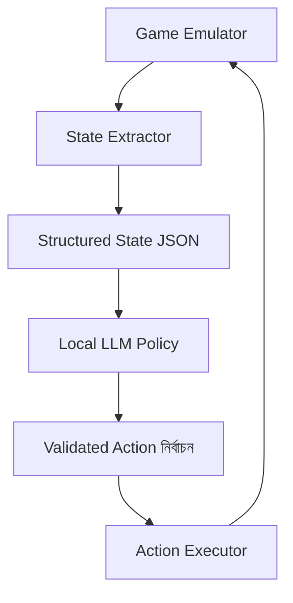

# Concept Paper: Local AI Control of a Turn-Based Game via Structured Game State and Tool Calling

## Abstract

This paper proposes a local, low-compute architecture for controlling a turn-based video game, such as the original *Pokémon* on Game Boy, using an AI agent without visual perception. The core idea is to convert the emulator’s game state into structured text or JSON, then allow a small local model to select from a constrained set of semantic actions. This avoids the inefficiency and unreliability of pixel-based control and makes the system suitable for consumer hardware with limited VRAM.

---

## 1. Problem Statement

Typical AI game agents rely on visual input, OCR, or large multimodal models. These approaches are computationally expensive and often brittle. For turn-based games with well-defined rules and state, such as classic *Pokémon*, this is unnecessary.

The problem is therefore not “how can an AI see the game,” but rather:

> How can the game be represented as structured state so that a small local model can reliably choose actions?

---

## 2. Core Hypothesis

A local AI agent can play a turn-based game effectively if:

1. the game state is exposed in a structured format,
2. the action space is restricted to valid semantic actions,
3. the model is used as a policy selector rather than a general-purpose reasoner,
4. tool execution is separated from decision-making.

This reduces the task from open-ended perception and control to structured state-to-action mapping.

---

## 3. Design Principles

### 3.1 Structured input over visual input

The agent should not receive screenshots unless absolutely necessary. Instead, the emulator should expose state such as:

* current location
* battle state
* menu state
* player party
* opponent status
* inventory
* current objective

This state should be converted into machine-readable text or JSON.

### 3.2 Constrained action space

The model should not emit raw button presses. It should choose from predeclared semantic actions such as:

* `fight:ThunderShock`
* `switch:Bulbasaur`
* `use_item:Potion`
* `run`
* `move:north`
* `open_menu`

This makes tool use predictable and easy to validate.

### 3.3 Deterministic execution

The AI must not directly manipulate the emulator. Instead, a controller layer should validate the model’s output and translate it into actual inputs.

### 3.4 Small model suitability

The task is suitable for small local models because the input is highly structured and the action space is small. Large models are not required if the environment is well designed.

---

## 4. Proposed System Architecture



### Components

#### 4.1 Emulator

Runs the game locally.

#### 4.2 State Extractor

Reads memory or emulator state and converts it into structured data.

#### 4.3 Policy Model

A small local LLM receives the structured state and selects the next action.

#### 4.4 Validator

Checks whether the model’s output is syntactically valid and allowed in the current context.

#### 4.5 Action Executor

Turns the selected semantic action into concrete emulator inputs.

---

## 5. State Representation

The state should be compact, explicit, and stable.

### Example state object

```json
{
  "location": "Viridian Forest",
  "mode": "battle",
  "player": {
    "active_pokemon": {
      "name": "Pikachu",
      "hp": 18,
      "max_hp": 35,
      "moves": [
        {"name": "ThunderShock", "pp": 12},
        {"name": "Growl", "pp": 30}
      ]
    },
    "party": ["Pikachu", "Bulbasaur", "Pidgey"]
  },
  "enemy": {
    "name": "Weedle",
    "hp": 10,
    "status": null
  },
  "menu": "fight",
  "goal": "win_battle"
}
```

### State design requirements

* explicit field names
* stable schema
* no prose unless needed
* no ambiguous abbreviations
* no hidden inference required

---

## 6. Action Representation

The model should choose only from valid actions available in the current state.

### Example action set

```json
{
  "actions": [
    "fight:ThunderShock",
    "fight:Growl",
    "switch:Bulbasaur",
    "use_item:Potion",
    "run"
  ]
}
```

### Action design requirements

* actions must be discrete
* actions must be context-aware
* invalid actions must be rejected before execution
* the action space should be as small as possible

---

## 7. Control Loop

The system should run as a repeated cycle:

1. read emulator state
2. normalize state into JSON
3. present state to policy model
4. receive proposed action
5. validate action
6. execute action
7. repeat

### Pseudocode

```python
while not done:
    state = read_game_state()
    structured_state = normalize(state)
    action = llm_policy(structured_state)
    if validate(action, structured_state):
        execute(action)
    else:
        execute(fallback_action(structured_state))
```

---

## 8. Role of the Local Model

The model is not the entire agent. It is only a policy selector.

### Appropriate responsibilities

* choose between valid actions
* handle local tactical decisions
* respond to structured prompts
* prefer one valid move over another

### Inappropriate responsibilities

* screen interpretation
* free-form planning over long horizons
* raw button control
* guessing hidden emulator state

This division is what makes the system reliable on limited hardware.

---

## 9. Suitable Model Classes

The system should favor small, efficient models that can run locally.

### Good candidates

* 1B–7B instruct-tuned LLMs
* quantized models
* CPU fallback models for slower but acceptable performance

### Practical characteristics

* fast inference
* consistent JSON output
* strong instruction following
* low memory footprint

For this kind of task, reliability comes more from interface design than raw model size.

---

## 10. Expected Strengths

This approach should work well for:

* turn-based battles
* menu navigation
* item selection
* simple progression
* local tactical choices
* short-horizon planning

The reason is that the game is partially observable but highly structured, and the action space is small.

---

## 11. Expected Weaknesses

The same approach will be weaker for:

* long exploration chains
* maze navigation
* puzzle solving
* long-term memory across many sessions
* ambiguous objectives
* dynamic planning across unknown maps

These can be mitigated with additional components such as rule-based navigation, short-term memory, or scripted fallback behaviors.

---

## 12. Reliability Measures

To make the agent usable rather than merely impressive, the following controls are recommended:

### 12.1 Schema validation

Reject any output that does not match the expected JSON structure.

### 12.2 Action whitelisting

Only allow actions that are valid in the current context.

### 12.3 Fallback logic

Use deterministic fallback actions when the model output is invalid.

### 12.4 Low-temperature generation

Reduce randomness to improve consistency.

### 12.5 State summarization

Keep the prompt small and focused on the current decision.

---

## 13. Implementation Strategy

A practical implementation can be staged:

### Stage 1: Battle-only prototype

* one battle loop
* fixed state schema
* small action set
* strict JSON output

### Stage 2: Menu and navigation support

* add overworld state
* add directional actions
* add goal field

### Stage 3: Memory and planning

* track objectives
* record map or progression state
* add fallback rules for stuck situations

### Stage 4: Optimization

* reduce prompt size
* cache repeated state transformations
* improve action validation

---

## 14. Evaluation Criteria

The system should be judged by measurable outcomes:

* percentage of valid actions produced
* percentage of actions that improve game state
* number of turns required to clear a battle
* number of invalid outputs per hour
* latency per decision
* recovery rate from bad states

The key question is not whether the model sounds intelligent, but whether it behaves consistently.

---

## 15. Conclusion

A local AI can plausibly play a turn-based game on modest hardware if the game is transformed into structured state and the model is constrained to selecting from a small action set. This shifts the task from visual reasoning to policy selection, which is much more feasible for compact local models.

The central design choice is simple:

> do not ask the model to perceive the game; ask it to choose from already interpreted state.

That distinction is what makes the system practical.

---

## Appendix: Minimal AI-Readable Interface Sketch

```json
{
  "task": "select_action",
  "state": {
    "location": "Viridian Forest",
    "mode": "battle",
    "player_hp": 18,
    "enemy_hp": 10
  },
  "actions": [
    "fight:ThunderShock",
    "fight:Growl",
    "use_item:Potion",
    "run"
  ],
  "output_format": {
    "action": "string"
  }
}
```

```json
{
  "action": "fight:ThunderShock"
}
```
