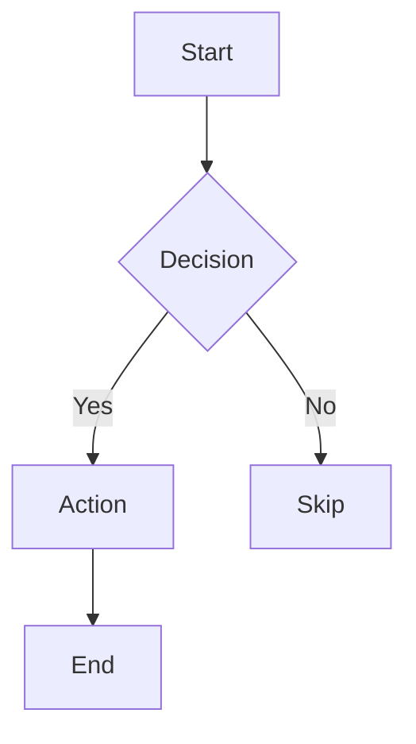
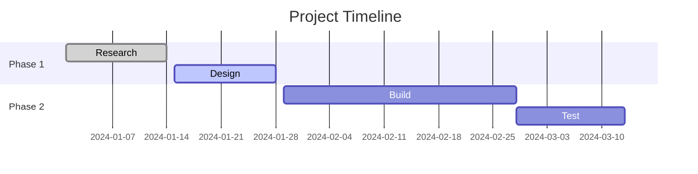
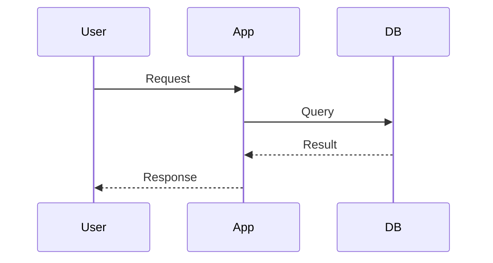
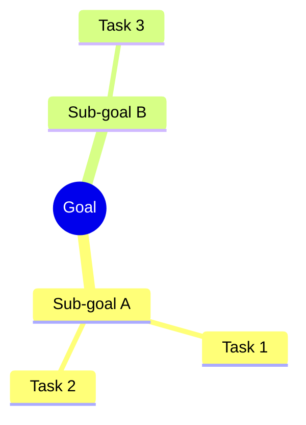

# {project_name} — Org

This project handles organisation: project planning, timetables, diagrams, workflows, and
task tracking. The AI generates diagrams from prose, drafts schedules, breaks goals into
tasks, and produces structured Markdown or exportable documents.

## Key software

- **Mermaid** — text-based diagrams that render in Markdown, GitHub, Obsidian, VS Code
- **PlantUML** — more powerful UML and C4 diagrams; needs Java or online renderer at plantuml.com
- **Markmap** — interactive mind maps from Markdown: `markmap file.md` or VS Code extension
- **Pandoc** — convert Markdown plans to PDF, DOCX, HTML: `pandoc plan.md -o plan.pdf`
- **Taskwarrior** — CLI task manager: `task add "description" due:tomorrow`, `task list`
- **Obsidian + Tasks plugin** — `- [ ] task text 📅 2024-01-15` inline task tracking

## Mermaid diagram reference

````markdown







````

## Task list conventions

```markdown
## Backlog
- [ ] Research options for X
- [ ] Draft proposal

## In progress
- [ ] Implement feature Y

## Done
- [x] Set up project structure
- [x] Write requirements
```

## Timetable (Markdown table)

```markdown
| Time     | Mon       | Tue      | Wed       | Thu      | Fri      |
|----------|-----------|----------|-----------|----------|----------|
| 09:00    | Deep work | Meetings | Deep work | Meetings | Review   |
| 12:00    | Lunch     | Lunch    | Lunch     | Lunch    | Lunch    |
| 13:00    | Admin     | Deep work| Admin     | Deep work| Planning |
```

## Typical tasks

- Generate a flowchart or architecture diagram from a prose description
- Create a Gantt chart from a list of tasks and estimated durations
- Break a high-level goal into a prioritised, hierarchical task list
- Draft a weekly or project timetable given constraints
- Write a mind map for brainstorming a topic or decision
- Produce a sequence diagram for a process or API interaction flow
- Identify the critical path and blockers in a project backlog

---

## Your setup

<!-- What you are organising:
     e.g. software project, weekly personal schedule, research workflow, life goals, event -->

<!-- Preferred diagram format: Mermaid / PlantUML / ASCII art / none -->

<!-- Output format: Markdown / PDF / HTML / printed -->

<!-- Tools in use: Obsidian / VS Code / Notion / pen-and-paper / other -->

<!-- Planning horizon: daily / weekly / quarterly / project-based -->

## Notes for the AI

<!-- Ongoing projects, recurring commitments, known constraints
     (fixed meetings, hard deadlines, energy patterns during the week). -->
